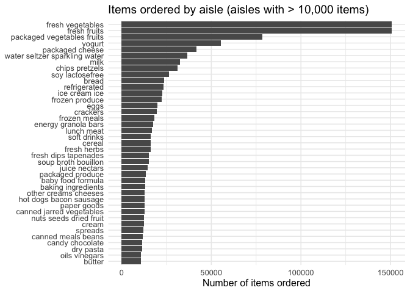

HW3
================
wd2311
2025-10-14

# Loading libraries

``` r
library(tidyverse)
```

    ## ── Attaching core tidyverse packages ──────────────────────── tidyverse 2.0.0 ──
    ## ✔ dplyr     1.1.4     ✔ readr     2.1.5
    ## ✔ forcats   1.0.0     ✔ stringr   1.5.2
    ## ✔ ggplot2   4.0.0     ✔ tibble    3.3.0
    ## ✔ lubridate 1.9.4     ✔ tidyr     1.3.1
    ## ✔ purrr     1.1.0     
    ## ── Conflicts ────────────────────────────────────────── tidyverse_conflicts() ──
    ## ✖ dplyr::filter() masks stats::filter()
    ## ✖ dplyr::lag()    masks stats::lag()
    ## ℹ Use the conflicted package (<http://conflicted.r-lib.org/>) to force all conflicts to become errors

``` r
library(janitor)
```

    ## 
    ## Attaching package: 'janitor'
    ## 
    ## The following objects are masked from 'package:stats':
    ## 
    ##     chisq.test, fisher.test

``` r
library(p8105.datasets)
library(knitr)
library(forcats)
```

# Problem 1

## Set up and brief description

The instacart dataset contains 1,384,617 observations and 15 variables,
each representing a single product added to a user’s grocery order on
the Instacart online shopping platform. Each row corresponds to one
product within one order, identified by variables such as: order_id
(unique order identifier), product_id and product_name (the specific
item purchased), add_to_cart_order (the position in which the item was
added), reordered (whether the product had been purchased before by the
same user), order_dow and order_hour_of_day (day of week and time the
order was placed), aisle and department (product category
classification).

``` r
data("instacart") 
glimpse(instacart)
```

    ## Rows: 1,384,617
    ## Columns: 15
    ## $ order_id               <int> 1, 1, 1, 1, 1, 1, 1, 1, 36, 36, 36, 36, 36, 36,…
    ## $ product_id             <int> 49302, 11109, 10246, 49683, 43633, 13176, 47209…
    ## $ add_to_cart_order      <int> 1, 2, 3, 4, 5, 6, 7, 8, 1, 2, 3, 4, 5, 6, 7, 8,…
    ## $ reordered              <int> 1, 1, 0, 0, 1, 0, 0, 1, 0, 1, 0, 1, 1, 1, 1, 1,…
    ## $ user_id                <int> 112108, 112108, 112108, 112108, 112108, 112108,…
    ## $ eval_set               <chr> "train", "train", "train", "train", "train", "t…
    ## $ order_number           <int> 4, 4, 4, 4, 4, 4, 4, 4, 23, 23, 23, 23, 23, 23,…
    ## $ order_dow              <int> 4, 4, 4, 4, 4, 4, 4, 4, 6, 6, 6, 6, 6, 6, 6, 6,…
    ## $ order_hour_of_day      <int> 10, 10, 10, 10, 10, 10, 10, 10, 18, 18, 18, 18,…
    ## $ days_since_prior_order <int> 9, 9, 9, 9, 9, 9, 9, 9, 30, 30, 30, 30, 30, 30,…
    ## $ product_name           <chr> "Bulgarian Yogurt", "Organic 4% Milk Fat Whole …
    ## $ aisle_id               <int> 120, 108, 83, 83, 95, 24, 24, 21, 2, 115, 53, 1…
    ## $ department_id          <int> 16, 16, 4, 4, 15, 4, 4, 16, 16, 7, 16, 4, 16, 2…
    ## $ aisle                  <chr> "yogurt", "other creams cheeses", "fresh vegeta…
    ## $ department             <chr> "dairy eggs", "dairy eggs", "produce", "produce…

``` r
n_obs  <- nrow(instacart)
n_vars <- ncol(instacart)
n_aisles <- instacart |> 
  distinct(aisle_id, aisle) |> 
  nrow()

c(n_obs, n_vars, n_aisles)
```

    ## [1] 1384617      15     134

## description on aisles

There are 134 aisles. The aisles with the greatest number of items
ordered are “fresh vegetables” (150,609 orders) and “fresh fruits”
(150,473 orders).

``` r
aisle_counts <- instacart |>
  count(aisle, sort = TRUE)

n_aisles <- nrow(aisle_counts)
n_aisles
```

    ## [1] 134

``` r
# top aisles
aisle_counts |> slice_head(n = 10) |> kable()
```

| aisle                         |      n |
|:------------------------------|-------:|
| fresh vegetables              | 150609 |
| fresh fruits                  | 150473 |
| packaged vegetables fruits    |  78493 |
| yogurt                        |  55240 |
| packaged cheese               |  41699 |
| water seltzer sparkling water |  36617 |
| milk                          |  32644 |
| chips pretzels                |  31269 |
| soy lactosefree               |  26240 |
| bread                         |  23635 |

## Plot on aisles with more than 10000 items

``` r
aisle_counts |>
  filter(n > 10000) |>
  mutate(aisle = fct_reorder(aisle, n)) |>
  ggplot(aes(x = n, y = aisle)) +
  geom_col() +
  labs(
    x = "Number of items ordered",
    y = NULL,
    title = "Items ordered by aisle (aisles with > 10,000 items)"
  ) +
  theme_minimal(base_size = 12)
```

<!-- -->

## Table for top3 items by aisle

``` r
top3_by_aisle <- instacart |>
  filter(aisle %in% c("baking ingredients", "dog food care", "packaged vegetables fruits")) |>
  count(aisle, product_name, sort = TRUE) |>
  group_by(aisle) |>
  slice_max(n, n = 3, with_ties = FALSE) |>
  arrange(aisle, desc(n)) |>
  ungroup()

kable(top3_by_aisle, col.names = c("Aisle", "Product", "Times ordered"))
```

| Aisle | Product | Times ordered |
|:---|:---|---:|
| baking ingredients | Light Brown Sugar | 499 |
| baking ingredients | Pure Baking Soda | 387 |
| baking ingredients | Cane Sugar | 336 |
| dog food care | Snack Sticks Chicken & Rice Recipe Dog Treats | 30 |
| dog food care | Organix Chicken & Brown Rice Recipe | 28 |
| dog food care | Small Dog Biscuits | 26 |
| packaged vegetables fruits | Organic Baby Spinach | 9784 |
| packaged vegetables fruits | Organic Raspberries | 5546 |
| packaged vegetables fruits | Organic Blueberries | 4966 |

## Table for mean hours of the day

``` r
dow_labs <- c("Sun","Mon","Tue","Wed","Thu","Fri","Sat")

mean_hour_tbl <- instacart |>
  filter(product_name %in% c("Pink Lady Apples", "Coffee Ice Cream")) |>
  mutate(dow = factor(order_dow, levels = 0:6, labels = dow_labs)) |>
  group_by(product_name, dow) |>
  summarise(mean_hour = mean(order_hour_of_day), .groups = "drop") |>
  mutate(mean_hour = round(mean_hour, 2)) |>
  pivot_wider(names_from = dow, values_from = mean_hour) |>
  arrange(product_name)

kable(mean_hour_tbl, col.names = c("Product","Sun","Mon","Tue","Wed","Thu","Fri","Sat"))
```

| Product          |   Sun |   Mon |   Tue |   Wed |   Thu |   Fri |   Sat |
|:-----------------|------:|------:|------:|------:|------:|------:|------:|
| Coffee Ice Cream | 13.77 | 14.32 | 15.38 | 15.32 | 15.22 | 12.26 | 13.83 |
| Pink Lady Apples | 13.44 | 11.36 | 11.70 | 14.25 | 11.55 | 12.78 | 11.94 |

``` r
library(tidyverse)

knitr::opts_chunk$set(
  fig.width = 6,
  fig.asp = .6,
  out.width = "90%"
)
```
